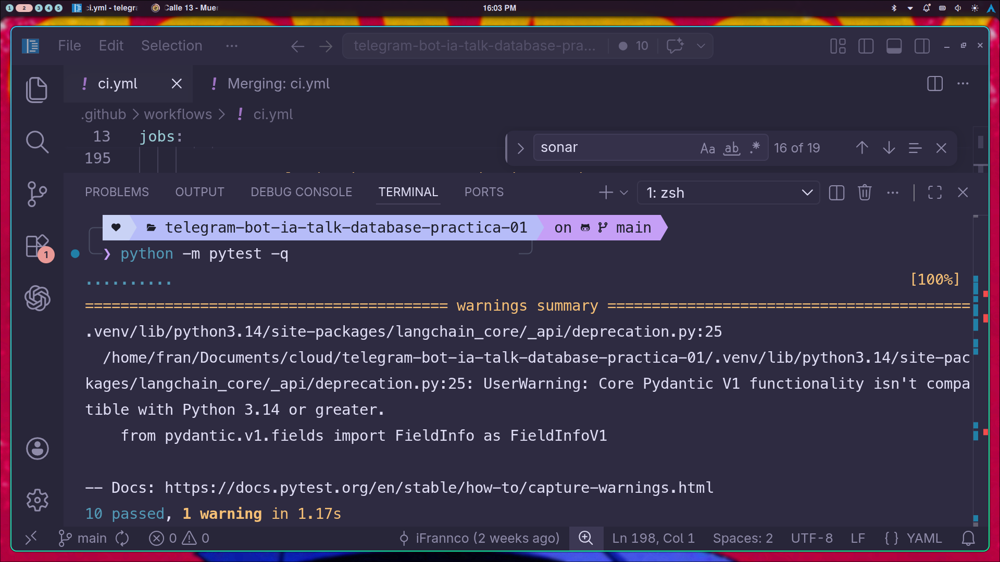
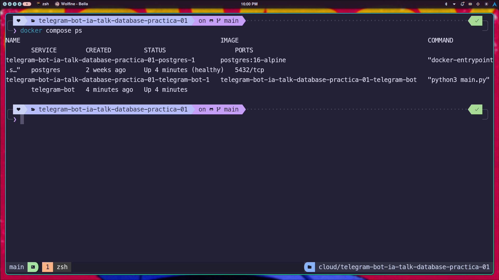
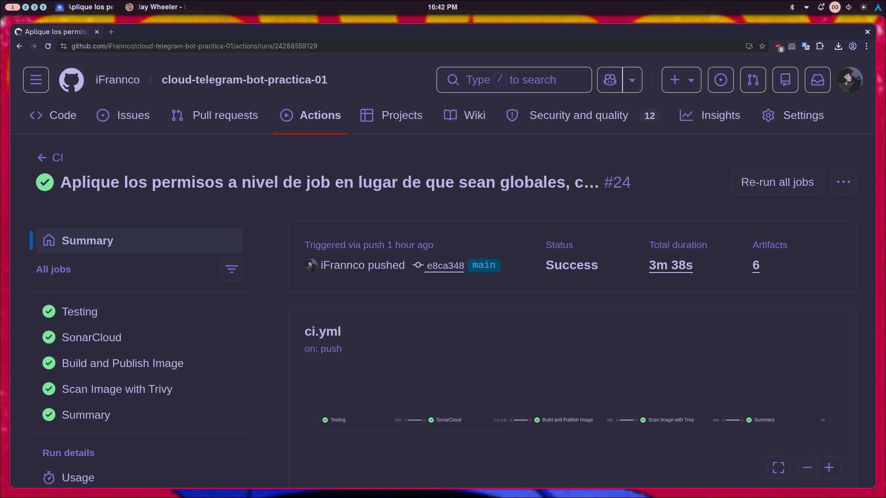
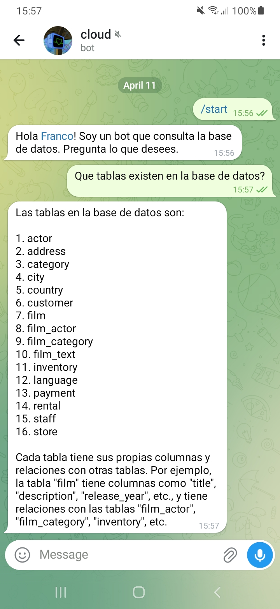

## 1. Introducción  
  
El presente trabajo tuvo como objetivo completar y dejar operativa la infraestructura necesaria para ejecutar una aplicación basada en un bot de Telegram integrado con LangChain y PostgreSQL, haciendo foco en los contenidos de la materia vinculados con contenedorización, automatización y CI/CD.  
  
A partir de la base provista por la cátedra, se trabajó principalmente sobre la definición del contenedor de la aplicación, la orquestación local con Docker Compose, la incorporación de pruebas automatizadas y la configuración del pipeline de integración continua.  
  
Si bien el proyecto incluye lógica propia de aplicación, en esta entrega el foco está puesto en la parte de Docker, testing y automatización del ciclo de integración.  
  
---  
  
## 2. Descripción general de la solución  
  
La solución implementada se compone de dos servicios principales:  
  
- Un contenedor para la aplicación del bot de Telegram.  
- Un contenedor para la base de datos PostgreSQL.  
  
La aplicación consulta una base de datos y responde a través de Telegram utilizando un agente construido con LangChain. Para que el entorno pueda levantarse de manera reproducible, se definió una configuración basada en Docker y Docker Compose, junto con un pipeline automatizado para validar el proyecto.  
  
---  
  
## 3. Implementación realizada  
  
### 3.1 Dockerfile  
  
Se completó el `Dockerfile` de la aplicación utilizando como imagen base `python:3.12.13-slim-bookworm`.  
  
Esta elección permitió contar con un entorno liviano y al mismo tiempo compatible con las dependencias del proyecto. En el contenedor se define el directorio de trabajo, se copian las dependencias declaradas en `requirements.txt`, se instalan con `pip` y luego se copia el código fuente de la aplicación.  
  
Finalmente, se configuró el comando de inicio para ejecutar el archivo principal del proyecto:  

```dockerfile
CMD ["python3", "main.py"]
```

De esta forma, el contenedor queda preparado para iniciar directamente la aplicación al ejecutarse.

### 3.2 Docker Compose

Se completó el archivo `docker-compose.yaml` definiendo los servicios necesarios para el entorno local:

- `telegram-bot`
- `postgres`

En el servicio de la aplicación se configuró la construcción de la imagen a partir del `Dockerfile` del proyecto y se declararon las variables de entorno necesarias para la conexión con Telegram, Groq y PostgreSQL.

En el servicio de PostgreSQL se utilizó la imagen `postgres:16-alpine`, lo que aporta una base liviana y adecuada para el entorno del trabajo práctico. Además, se configuraron:

- variables de entorno para el usuario, la contraseña y la base;
- un volumen persistente para los datos;
- el montaje de la carpeta `sql-init` para inicializar la base;
- un `healthcheck` con `pg_isready` para verificar disponibilidad.

También se estableció la dependencia de la aplicación respecto del servicio de base de datos, usando la condición de servicio saludable. Esto permite que el bot se inicie una vez que PostgreSQL está listo para aceptar conexiones.

### 3.3 Pruebas automatizadas

Se incorporaron pruebas unitarias utilizando `pytest` y `pytest-cov`.

Las pruebas cubren componentes importantes del proyecto, entre ellos:

- validación de variables de entorno y configuración;
- inicialización de la conexión a base de datos;
- creación del agente LLM;
- flujo principal de inicialización de la aplicación.

La ejecución de pruebas genera además dos artefactos relevantes para la automatización:

- `coverage.xml`, para el reporte de cobertura;
- `report.xml`, para resultados en formato JUnit.

Durante la validación local se ejecutaron correctamente las pruebas del proyecto.

### 3.4 CI/CD

Se completó la automatización del proyecto para validar el código y ejecutar tareas de integración continua.

Por un lado, el repositorio conserva la definición en `.gitlab-ci.yml`, en línea con la consigna original. Por otro lado, la verificación automática visible en el repositorio se encuentra configurada en GitHub Actions sobre la rama `main`.

El flujo de integración continua implementado contempla las siguientes etapas:

#### Testing

Se instalan dependencias y se ejecutan las pruebas unitarias con generación de reportes.

#### Análisis de calidad

Se integra SonarCloud para analizar el proyecto y utilizar el reporte de cobertura generado durante la etapa de testing.

#### Construcción de imagen

Se construye la imagen Docker de la aplicación y se publica en GHCR.

#### Escaneo de seguridad

Se utiliza Trivy para analizar la imagen construida, generar reportes de seguridad y producir un SBOM en formato compatible con la automatización del repositorio.

La ejecución del pipeline puede comprobarse directamente en GitHub sobre la rama `main`, donde el estado exitoso del flujo de integración continua se refleja mediante el indicador verde de la plataforma.

---

## 4. Decisiones tomadas

Durante la resolución del trabajo se tomaron las siguientes decisiones técnicas:

### Uso de una imagen Python slim

Se eligió una imagen `slim` para reducir el tamaño del contenedor sin perder compatibilidad con las bibliotecas necesarias del proyecto.

### Separación de servicios

Se mantuvo la separación entre aplicación y base de datos, lo que facilita la ejecución, la depuración y la administración del entorno.

### Inicialización automática de PostgreSQL

Se utilizó la carpeta `sql-init` para cargar el esquema y los datos necesarios al levantar la base, evitando configuraciones manuales adicionales.

### Healthcheck en la base de datos

Se agregó un control de salud en PostgreSQL para mejorar el arranque coordinado entre servicios y evitar que la aplicación intente conectarse antes de tiempo.

### Automatización de reportes

Se decidió generar reportes de cobertura y resultados de tests para integrarlos al pipeline y dejar evidencia verificable de la validación del proyecto.

### Integración de calidad y seguridad

Se incorporaron herramientas de análisis estático y escaneo de imagen para complementar la construcción del contenedor con controles automáticos adicionales.

---

## 5. Validación local

Para validar el funcionamiento del entorno se utilizó el siguiente comando de levantamiento local:

`docker compose up --build`

Además, las pruebas unitarias se ejecutaron con el siguiente comando:

`pytest --cov=. --cov-report=xml --junitxml=report.xml`

Estas verificaciones permitieron confirmar el funcionamiento general del proyecto en entorno local, incluyendo el arranque de contenedores, la ejecución de las pruebas y la interacción con el bot.

---

## 6. Evidencia de funcionamiento

A continuación se incorporan las capturas utilizadas como evidencia de funcionamiento del proyecto.

### 6.1 Ejecución local de pruebas unitarias

En esta captura se observa la ejecución de las pruebas unitarias del proyecto en entorno local.




### 6.2 Contenedores levantados en entorno local

En esta imagen se muestra el entorno levantado mediante Docker Compose, con los contenedores de la aplicación y la base de datos en funcionamiento.




### 6.3 Pipeline ejecutado exitosamente

En esta captura se visualiza la ejecución exitosa del pipeline de integración continua asociado al repositorio. Esta evidencia permite verificar que las etapas automatizadas configuradas para validación del proyecto se ejecutan correctamente sobre la rama principal.




### 6.4 Conversación con el bot en ejecución

En esta captura se demuestra el funcionamiento de la aplicación una vez levantado el entorno local, evidenciando que el bot responde correctamente luego de iniciados los contenedores necesarios.



---

## 7. Conclusión

El trabajo permitió completar los componentes necesarios para ejecutar y validar el proyecto utilizando herramientas propias del enfoque de Cloud Computing, especialmente en lo referido a contenedorización, orquestación local y automatización.

Como resultado, el proyecto quedó preparado para:

- ejecutarse localmente mediante contenedores;
- inicializar automáticamente la base de datos requerida;
- validar su funcionamiento con pruebas automatizadas;
- ejecutar un pipeline de integración continua con etapas de testing, calidad, build y seguridad.

En síntesis, la entrega no solo completa los archivos solicitados por la consigna, sino que también documenta las decisiones adoptadas y presenta evidencia concreta del funcionamiento del proyecto.