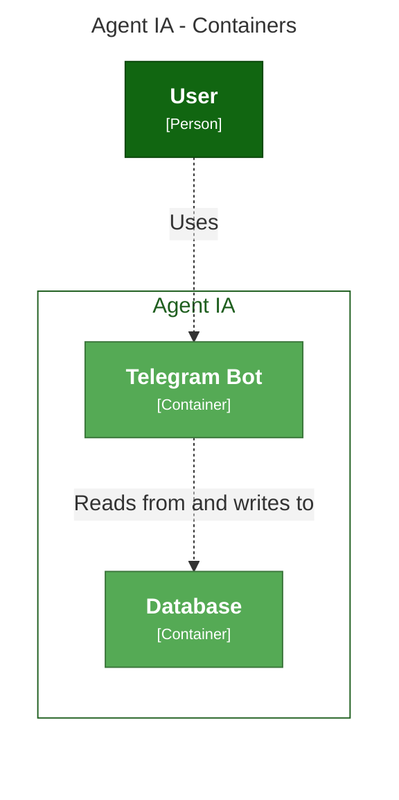
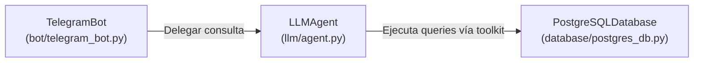
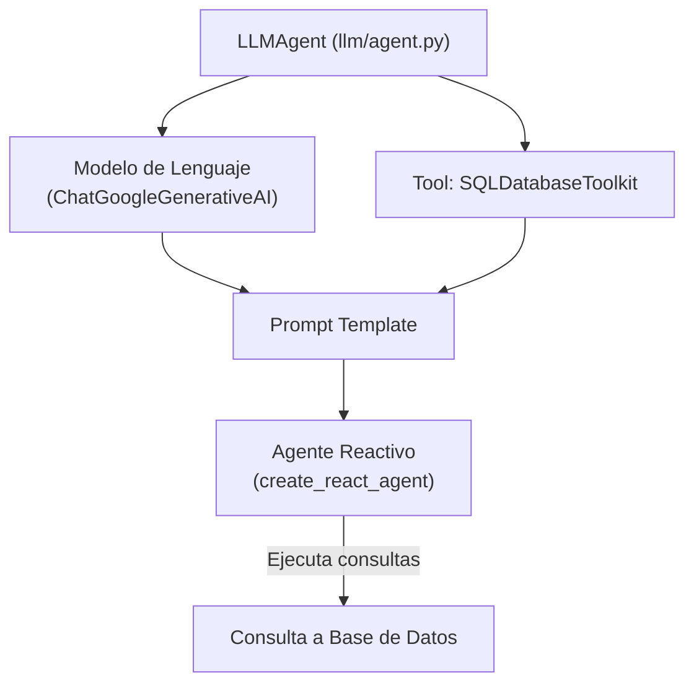
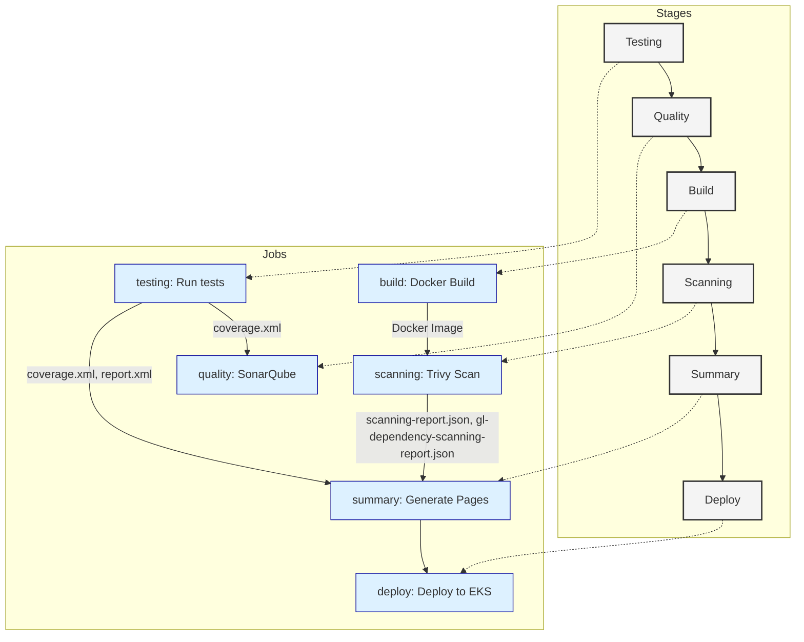
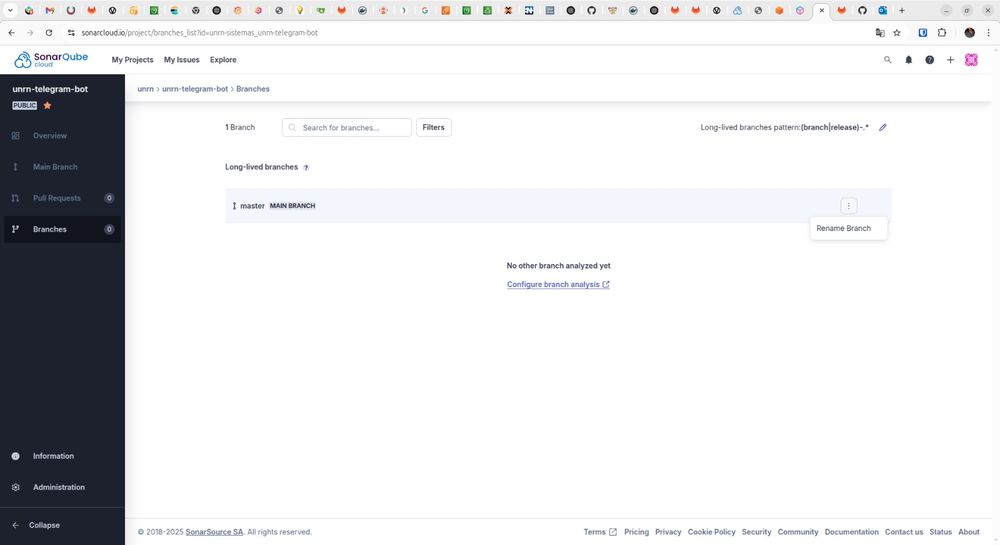
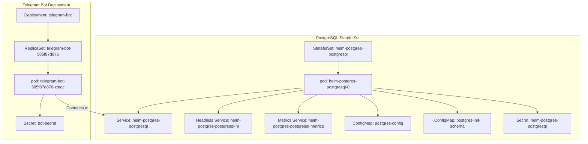

# Telegram Bot con LangChain

[Fuente base de la implementación](https://medium.com/@obaff/building-a-telegram-bot-using-langchain-openai-and-the-telegram-api-1834167e524b)

## Consigna
[Consigna de practico 01](CONSIGNA.md)

[Consigna de practico 02.1](CONSIGNA21.md)

## Como ejecutar de forma local
[Ejecutar y Depurar Local con devContainer](DEVLOCAL.md)

---

## Contenido

- [Introducción](#introducción)
- [Requisitos](#requisitos)
- [Arquitectura](#arquitectura)
- [Instalación y Ejecución](#instalación-y-ejecución)
- [Pruebas (Testing)](#pruebas-testing)
- [Docker y Docker Compose](#docker-y-docker-compose)
- [CI/CD](#cicd)
  - [Quality - SonarCloud](#quality---sonarcloud)
  - [Seguridad y SBOM](#seguridad-y-sbom)
- [Resumen del CICD](#resumen-del-cicd)
- [Referencias](#referencias)

---

## Introducción

Este proyecto integra un bot de Telegram con LangChain para proporcionar funcionalidades inteligentes. La aplicación se conecta a servicios como PostgreSQL y emplea diversas herramientas para pruebas, análisis de calidad y seguridad.

---

## Requisitos

- **Python 3.11** o superior.
- Dependencias de Python listadas en [requirements.txt](requirements.txt):
  - `python-telegram-bot`
  - `langchain`
  - *etc.*

Para las pruebas se utilizan:  
- `pytest`
- `pytest-cov`

---

## Arquitectura

La estructura del proyecto es la siguiente:

```
.
├── .env
├── .gitlab-ci.yml
├── README.md
├── Dockerfile
├── docker-compose.yaml
├── requirements.txt
├── config.py
├── main.py
├── bot/
│   └── telegram_bot.py
├── database/
│   └── postgres_db.py
├── llm/
    └── agent.py

```

### Arquitectura de Agentes

[llm-agents](https://www.promptingguide.ai/research/llm-agents)


### Diagrama C4


#### Nivel 2 Contenedores



### Nivel 3 Componetes


### Nivel 3.1 Agente Componetes


---

## Instalación y Ejecución

1. **Clonar el repositorio y configurar variables de entorno**  
   Copia el archivo `.env.example` a `.env` y configura las claves necesarias (por ejemplo, `TELEGRAM_BOT_TOKEN` y `GOOGLE_API_KEY`).

2. **Instalar dependencias**

   ```bash
   pip install -r requirements.txt
   ```

3. **Ejecutar la aplicación**

   ```bash
   python3 main.py
   ```

---

## Pruebas (Testing)

Para ejecutar las pruebas unitarias y generar reportes de cobertura, usa:

```bash
pytest --cov=. --cov-report=xml --junitxml=report.xml
```

Los archivos generados serán:
- `coverage.xml` (formato Cobertura)
- `report.xml` (resultados en formato JUnit)

Ejemplo de configuración en GitLab CI:

```yaml
artifacts:
  paths:
    - coverage.xml
    - report.xml
```

Los tests se encuentran en la carpeta `test/`.

---

## Docker y Docker Compose

### Dockerfile

El [Dockerfile](Dockerfile) utiliza la imagen base `alpine:latest` con configuraciones para Python:

```dockerfile
FROM .....

WORKDIR /app

.....

CMD ["python3", "......"]
```

### Docker Compose

Levanta todos los servicios (bot, base de datos, etc.) con:

```bash
docker-compose up --build
```

El archivo [docker-compose.yaml](docker-compose.yaml) define la configuración de los contenedores.

---

## CI/CD

- States y Jobs con sus Artefactos 

---



El pipeline en GitLab CI (definido en [.gitlab-ci.yml](.gitlab-ci.yml)) está compuesto por varias etapas:

### Testing

Ejecuta las pruebas y genera reportes de calidad y cobertura.

### Quality - SonarCloud

[SonarQube + Gitlab](https://wiki.geant.org/display/GSD/Continuous+Integration+Setup+with+GitLab+CI+and+SonarQube)

Utiliza SonarCloud para el análisis de la calidad del código. Ejemplo de comando:

```bash
/usr/bin/entrypoint.sh sonar-scanner \
  -Dsonar.login="$SONAR_LOGIN" \
  -Dsonar.organization="$SONAR_ORGANIZATION" \
  -Dsonar.host.url="$SONAR_URL" \
  -Dsonar.projectKey="$SONAR_PROYECT_KEY" \
  -Dsonar.python.coverage.reportPaths=coverage.xml
```

La salida se captura como artifact (`sonar.log`) para su revisión.

#### Problema con la rama principal al integrar SonarCloud con GitLab CI

Cuando configuramos un análisis con *SonarCloud* desde *GitLab CI*, nos encontramos con una advertencia relacionada con el nombre de la rama principal del repositorio. GitLab crea la rama por defecto con el nombre main, mientras que **SonarCloud espera una rama master como principal**, lo cual puede generar advertencias como:

> "La rama analizada no es la rama principal del proyecto."

Esto puede afectar cómo se muestran los resultados del análisis, por ejemplo:

- No tener comparaciones correctas con la línea base.
- Que no se apliquen correctamente los quality gates.

---

#### Solución

La solución más común es *configurar explícitamente la rama principal en SonarCloud* para que coincida con la que usa GitLab (main en la mayoría de los casos), evitando así inconsistencias en los reportes de calidad.



### Seguridad y SBOM

[vulnerabilities](https://medium.com/@maheshwar.ramkrushna/scanning-docker-images-for-vulnerabilities-using-trivy-for-effective-security-analysis-fa3e2844db22)

Se emplea [Trivy](https://github.com/aquasecurity/trivy) para:
- Escanear la imagen en busca de vulnerabilidades:
  
  ```bash
  trivy image $IMAGE --exit-code 0 --severity CRITICAL,HIGH --format template --template "@./contrib/gitlab-codequality.tpl" -o scanning-report.json
  ```
  
- Generar un SBOM en formato SPDX:
  
  ```bash
  trivy image $IMAGE --exit-code 0 --format spdx-json -o gl-dependency-scanning-report.json
  ```

Los artifacts correspondientes se configuran en el CI para que GitLab los integre en el Security Dashboard.

---

## Resumen del CICD

El pipeline finaliza mostrando un resumen en GitLab Pages, donde se agrupan los resultados de pruebas, cobertura y escaneos de seguridad.

Consulta el [Gitlab Pages](https://telegram-bot-ia-talk-database-f72817.gitlab.io/) para ver el resumen en formato HTML.

---

# K8S Actividad Practica 2

# K8S


# Crear Recursos de K8s y Pipeline CI/CD

Esta sección explica cómo se configuran y despliegan los recursos de Kubernetes y cómo se integra el pipeline CI/CD para automatizar las actualizaciones del Deployment.

## Recursos en Kubernetes

El despliegue del proyecto se compone de distintos recursos que se crean mediante Kubernetes:

- **Namespace:**  
  Define el ámbito donde se crearán y administrarán los recursos. Por ejemplo, se utiliza el namespace `grupo00` para todos los objetos del proyecto.

- **Deployment (Telegram Bot):**  
  El Deployment gestiona la actualización y el escalado del bot de Telegram. Actualiza la imagen del contenedor y se encarga de reiniciar los Pods en caso de fallos.  
  *Ejemplo de actualización usando `kubectl set image`:*  
  ```bash
  kubectl set image deployment/telegram-bot telegram-bot=$IMAGE -n grupo00 --record
  ```
  - **Parámetros:**
    - `deployment/telegram-bot`: Especifica el recurso de tipo Deployment llamado `telegram-bot`.
    - `telegram-bot=$IMAGE`: Indica que el contenedor llamado `telegram-bot` se actualizará con la imagen definida por la variable `$IMAGE`.
    - `-n grupo00`: Aplica la acción en el namespace `grupo00`.
    - `--record`: Registra el comando en la anotación del Deployment, facilitando el seguimiento de los cambios.

- **ConfigMap y Secret:**  
  Los ConfigMap guardan variables de configuración (por ejemplo, credenciales o parámetros no sensibles) y los Secret almacenan información sensible (como tokens o contraseñas).  
  - Se utilizan para inyectar variables en el Deployment sin incluirlas directamente en la imagen del contenedor.
  - Ejemplo de creación de un Secret para credenciales de acceso a un registry:
    ```bash
    kubectl create secret docker-registry my-registry-secret \
      --docker-server=registry.gitlab.com \
      --docker-username=<USER> \
      --docker-password=<TOKEN>
    ```

- **Helm Chart para Postgres:**  
  Se emplea un Helm Chart para desplegar y configurar una base de datos PostgreSQL. Esto incluye la creación de:
  - StatefulSet
  - Servicios (Service, Headless Service y Metrics Service)
  - Los ConfigMap y Secret necesarios para la inicialización y configuración de Postgres.

## CI/CD y Despliegue con AWS CLI y kubectl

El pipeline de GitLab CI/CD está configurado para realizar distintas etapas, desde la ejecución de pruebas hasta el despliegue final. Algunos aspectos claves son:

- **Jobs y Etapas:**  
  El pipeline se divide en varias etapas:  
  - **Testing:** Ejecuta las pruebas unitarias y genera reportes de cobertura.
  - **Quality:** Realiza el análisis de calidad del código utilizando SonarCloud.
  - **Build:** Construye y envía la imagen Docker a un registry.
  - **Scanning:** Escanea la imagen en busca de vulnerabilidades mediante Trivy.
  - **Summary:** Genera un resumen en GitLab Pages con los resultados de las pruebas y escaneos.
  - **Deploy:** Actualiza el Deployment de Kubernetes con la nueva imagen.

- **Configuración del Job Deploy:**  
  Se utiliza una imagen base (Alpine en este caso) para instalar herramientas como `aws-cli`, `curl` y `kubectl`, aunque es posible cambiarla a una imagen basada en Ubuntu o Debian si se prefiere.  
  La configuración se resume en los siguientes pasos en el `before_script` del job:
  1. **Instalación de herramientas:**  
     Usando `apk add` para instalar `curl`, `bash`, `ca-certificates` y `aws-cli`.
  2. **Instalación de kubectl:**  
     Se descarga el binario oficial de `kubectl` con `curl` y se coloca en `/usr/local/bin`.
  3. **Verificación de instalaciones:**  
     Se ejecuta `aws --version` y `kubectl version --client` para confirmar que las herramientas están disponibles.
  4. **Configuración de credenciales AWS:**  
     Se configuran las credenciales y se genera el kubeconfig para el cluster EKS usando AWS CLI.
  5. **Actualización del Deployment:**  
     Con `kubectl set image` se actualiza el contenedor del Deployment `telegram-bot` en el namespace `grupo00`.

- **Uso del Flag `--record`:**  
  Cuando se actualiza el Deployment, el flag `--record` registra el comando de actualización en la anotación del Deployment, lo que facilita el seguimiento del historial de cambios y auditorías.

## Resumen

Esta configuración de recursos en Kubernetes y el pipeline CI/CD permiten:
- Automatizar la ejecución y pruebas del proyecto.
- Generar y visualizar reportes de cobertura y seguridad.
- Desplegar actualizaciones de forma rápida mediante la actualización de la imagen del Deployment.
- Gestionar la configuración de la base de datos a través de un Helm Chart.


---


## Referencias

- [Documentación de Python Telegram Bot](https://github.com/python-telegram-bot/python-telegram-bot)
- [LangChain en GitHub](https://github.com/langchain-ai/langchain)
- [PostgreSQL Sakila](https://github.com/openpotato/sakila-db/tree/main/PostgreSQL)
- [Trivy - Seguridad de Contenedores](https://github.com/aquasecurity/trivy)
- [SonarCloud](https://sonarcloud.io)

---

Este README busca ser una guía de referencia para comprender el funcionamiento del proyecto, facilitar su despliegue y asegurar la calidad, seguridad y cobertura de pruebas a lo largo del ciclo de vida del desarrollo.